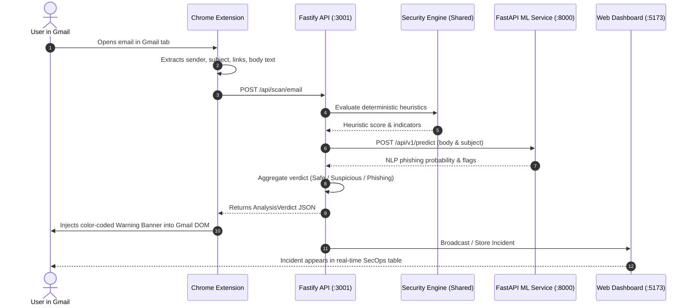

# OneMoon MVP Implementation Guide 🚀

This document defines the actionable, step-by-step roadmap for implementing the **OneMoon Minimum Viable Product (MVP)**. It outlines exact data contracts, components, and the core end-to-end detection pipeline.

---

## 1. MVP Objective & Scope

The sole purpose of the MVP is to prove the **end-to-end defense loop**:
1. A user views an email inside the **Gmail Web Client**.
2. The **Chrome Extension** detects the email DOM and sends sanitized metadata to the **Fastify API**.
3. The **API** orchestrates:
   - Rule-based heuristics via **`@onemoon/security-engine`** (sender spoofing, link typosquatting).
   - Semantic NLP intent scoring via the **FastAPI ML Service** (urgency, credential harvesting pretexts).
4. The **API** returns an **`AnalysisVerdict`**.
5. The **Chrome Extension** injects a visual warning banner into Gmail.
6. The **Dashboard** dynamically displays the newly detected incident in its live feed.



---

## 2. Shared Data Contracts (`packages/types`)

The following data shapes are used across all MVP modules:

### Scan Request (`ScanEmailPayload`)
```typescript
export interface ScanEmailPayload {
  emailId: string;
  senderName: string;
  senderAddress: string;
  subject: string;
  bodySnippet: string;
  links: string[];
  receivedAt: string;
}
```

### Analysis Verdict (`AnalysisVerdict`)
```typescript
export type ThreatLevel = 'safe' | 'suspicious' | 'phishing';

export interface ThreatIndicator {
  type: 'display_name_spoof' | 'homoglyph_url' | 'urgency_pressure' | 'suspicious_tld' | 'ml_heuristic';
  severity: 'low' | 'medium' | 'high';
  description: string;
  matchedContent?: string;
}

export interface AnalysisVerdict {
  id: string;
  threatLevel: ThreatLevel;
  riskScore: number; // 0 (Clean) to 100 (Severe Phishing)
  summary: string;
  indicators: ThreatIndicator[];
  analyzedAt: string;
}
```

---

## 3. Step-by-Step Implementation Roadmap

### Step 1: Implement Detection Heuristics (`packages/security-engine`)
* **File**: `packages/security-engine/src/index.ts`
* **Tasks**:
  1. **Display Name vs. Sender Domain Check**:
     - Flag cases where `senderName` resembles high-value brands (e.g. "PayPal", "Google Security", "Microsoft IT", "DocuSign") but `senderAddress` does not end with `@paypal.com`, `@google.com`, etc.
  2. **Typosquatting & Homoglyph URL Scanner**:
     - Detect lookalike characters (Cyrillic `а`, `о`, numeric `0` for `o`, `rn` for `m`).
     - Flag suspicious top-level domains (`.xyz`, `.top`, `.zip`, `.tk`).
  3. **Urgency Keyword Heuristic**:
     - Check subject and snippet for high-pressure terms: *"immediate action required"*, *"account suspended"*, *"wire funds"*, *"password expired"*.

---

### Step 2: Implement ML NLP Intent Classifier (`apps/ml-service`)
* **Directory**: `apps/ml-service/app/`
* **Tasks**:
  1. Create route `POST /api/v1/predict` in `app/api/predict.py`.
  2. Implement semantic heuristic analysis or a lightweight HuggingFace zero-shot / DistilBERT classification pipeline:
     - Detects pretext categories: **Credential Harvesting**, **Financial Extortion**, **Urgency Coercion**.
  3. Returns:
     ```json
     {
       "phishing_prob": 0.88,
       "confidence": 0.94,
       "detected_intents": ["financial_urgency", "credential_harvesting"]
     }
     ```

---

### Step 3: Implement Backend Orchestrator (`apps/api`)
* **Directory**: `apps/api/src/`
* **Tasks**:
  1. **Route `POST /api/scan/email`**:
     - Accepts `ScanEmailPayload`.
     - Invokes `securityEngine.analyze(...)`.
     - Calls `http://localhost:8000/api/v1/predict` with email text.
     - Merges scores: `finalScore = (heuristicScore * 0.5) + (mlScore * 0.5)`.
     - Stores result in an in-memory incident list (or PostgreSQL table).
  2. **Route `GET /api/incidents`**:
     - Returns array of recent `AnalysisVerdict` objects for the dashboard.

---

### Step 4: Implement Chrome Extension Gmail Ingest & UI (`apps/extension`)
* **Directory**: `apps/extension/src/`
* **Tasks**:
  1. **Gmail DOM Extractor** (`src/content/gmail/index.ts`):
     - Uses a `MutationObserver` on the Gmail message view container (`div[role="main"]`).
     - Extracts:
       - Sender name and email address from `span[email]`.
       - Email subject from `h2.hP`.
       - Extracted URLs from `a[href]` tags within `.a3s.aiL` (Gmail email body).
  2. **Banner Component & DOM Injection**:
     - Injects a stylized alert card directly above the email body:
       - **Green Banner**: "🛡️ OneMoon: Verified Safe Sender"
       - **Amber Banner**: "⚠️ OneMoon Caution: Unverified Sender / External Links"
       - **Red Banner**: "🚨 OneMoon Alert: Suspected Spear-Phishing Attack!"
  3. **Toolbar Popup & Sidepanel Sync**:
     - Communicates with background worker via `chrome.runtime.sendMessage` to display active analysis details in the popup or sidepanel.

---

### Step 5: Implement Live Incident Feed in Web Dashboard (`apps/dashboard`)
* **Directory**: `apps/dashboard/src/`
* **Tasks**:
  1. Poll or fetch `GET /api/incidents` from `http://localhost:3001/api/incidents`.
  2. Replace static metrics in `App.tsx` with dynamic totals:
     - Scanned Messages count.
     - Flagged Threats count.
     - High Risk / Critical Incidents table with timestamps, sender addresses, and risk score badges.

---

## 4. Test Scenarios for MVP Verification

To validate the MVP, use the following test cases:

| Test Case | Sender | Subject / Content | Expected Verdict |
| :--- | :--- | :--- | :--- |
| **Clean Corporate Email** | `alice@company.com` | "Weekly Sprint Review agenda" | 🟢 **Safe** (Score < 20) |
| **Brand Impersonation** | "Google Security" `<alert@goog1e-verify.xyz>` | "Critical Security Alert: Password compromised" | 🔴 **Phishing** (Score > 80) |
| **Urgent Financial Fraud** | "CEO John Smith" `<john.smith@gmail.com>` | "Urgent wire transfer needed before 4 PM today" | 🔴 **Phishing** (Score > 85) |
| **Suspicious Link** | `newsletter@updates.com` | "Check your bonus: http://rnicrosoft.com/login" | 🟡 **Suspicious** (Score ~65) |

---

## 5. Scope Guardrails: What is Intentionally Deferred

To ensure rapid delivery, do **not** build the following during MVP:
* ❌ Real blockchain smart contracts (use simple SHA-256 hash or mock receipt).
* ❌ Paid third-party API keys (VirusTotal, AbuseIPDB rate-limits).
* ❌ Multi-user authentication & SSO.
* ❌ Full browser tab history surveillance (focus exclusively on Gmail web view).
